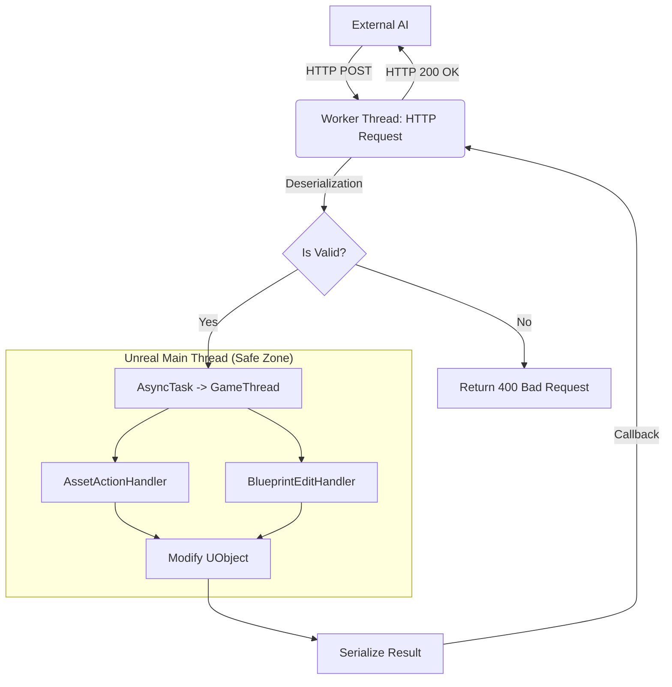

# 🏛️ LogosBridge: Arquitetura de Sistemas (Deep Dive)

Esta arquitetura descreve como o **LogosBridge** resolve o problema fundamental de controlar um motor de jogo _real-time_ e _stateful_ (Unreal Engine) a partir de uma inteligência externa _stateless_ (IA/Python).

## 1. O Problema da Concorrência (Threading Model)

O Unreal Engine não é _thread-safe_ para operações de Gameplay ou Editor. Quase todas as funções que manipulam `UObjects` (Assets, Atores, Blueprints) **devem** ser executadas na **Game Thread** (ou Main Thread).

O servidor HTTP do Unreal (`HTTPServerModule`), no entanto, recebe requisições em _worker threads_ separadas para não bloquear a renderização.

### A Solução: Dispatching Assíncrono

O `HttpServerManager` atua como um "despachante" de fronteira. Ele nunca executa lógica de negócio diretamente.



**Código Crítico (`HttpServerManager.cpp`):**

```cpp
// Recebido na Thread HTTP (Perigoso para UObjects)
AsyncTask(ENamedThreads::GameThread, [this, OnComplete]() {
    // Executado na Game Thread (Seguro)
    FString Result = Handler::Process();
    SendResponse(OnComplete, Result);
});
```

---

## 2. Ciclo de Vida do Módulo (`LogosBridgeModule`)

O plugin é carregado na fase `PostEngineInit`. Isso garante que o Editor já esteja totalmente inicializado, com o subsistema de Python e Asset Registry prontos.

1. **StartupModule()**:
   - Inicializa o Singleton `FHttpServerManager`.
   - Registra as rotas (`/api/create`, `/api/query`, etc).
   - Inicia o Listener na porta **8080**.

2. **ShutdownModule()**:
   - Desregistra as rotas.
   - Para o servidor HTTP para liberar a porta.
   - Limpa ponteiros inteligentes.

---

## 3. Subsistemas Integrados

O LogosBridge não reinventa a roda; ele orquestra subsistemas nativos do Unreal:

### A. Python Scripting Bridge (PEDIR PARA A IA GERAR O SCRIPT PYTHON E INSERI-LO MANUALMENTE NA ENGINE PARECE SER MUITO MAIS RAPIDO)

Em vez de escrever interpretadores complexos em C++, usamos o plugin `PythonScriptPlugin` oficial.

- **Fluxo:** O endpoint `/run_script` recebe string -> Salva em `Saved/TempLogosScript.py` -> Executa `GEngine->Exec("py ...")`.
- **Vantagem:** Permite que a IA use bibliotecas como `numpy` ou acesse APIs do Unreal que não expusemos explicitamente em C++.

### B. Asset Tools & Registry

- **AssetTools:** Usado para operações de arquivo (Duplicate, Rename, Create). É a mesma API que o Content Browser usa quando você clica com o botão direito.
- **AssetRegistry:** Usado para "Discovery". Permite listar milhares de arquivos sem carregá-los na RAM, lendo apenas os cabeçalhos (`FAssetData`).

### C. GEditor Transactions

- O sistema de Undo/Redo do Unreal é baseado em transações.
- Nossos Handlers abrem explicitamente transações (`BeginTransaction`) antes de editar qualquer propriedade. Isso faz com que as ações da IA apareçam no histórico "Undo" do editor como se fossem ações humanas.

---

## 4. Segurança e Limitações

- **Sem Autenticação:** Atualmente o serviço roda em `localhost` sem tokens. **Não exponha a porta 8080 para a internet.**
- **Bloqueio de Thread:** Como as tarefas são despachadas para a Game Thread, uma operação muito pesada (ex: gerar 1 milhão de pilares) vai "congelar" a interface do editor até terminar. O uso de `AsyncTask` não evita isso (pois roda na GameThread); ele apenas evita _crashes_.
